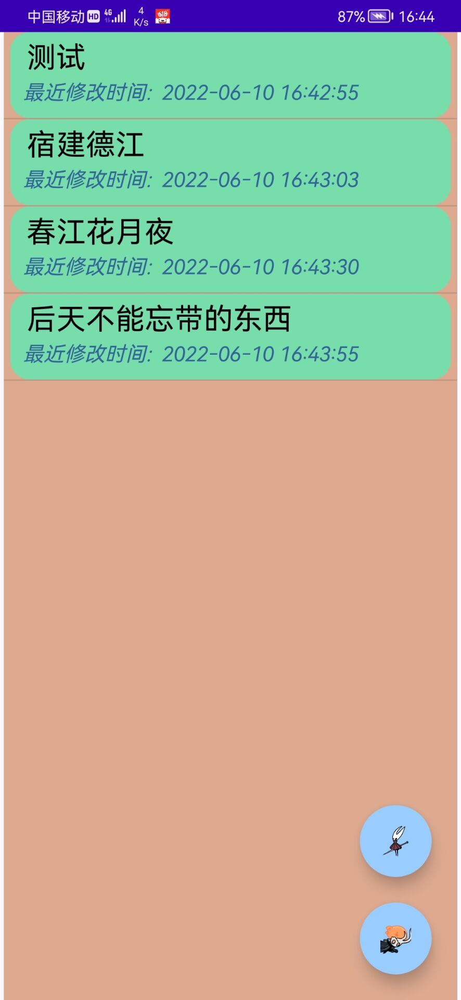
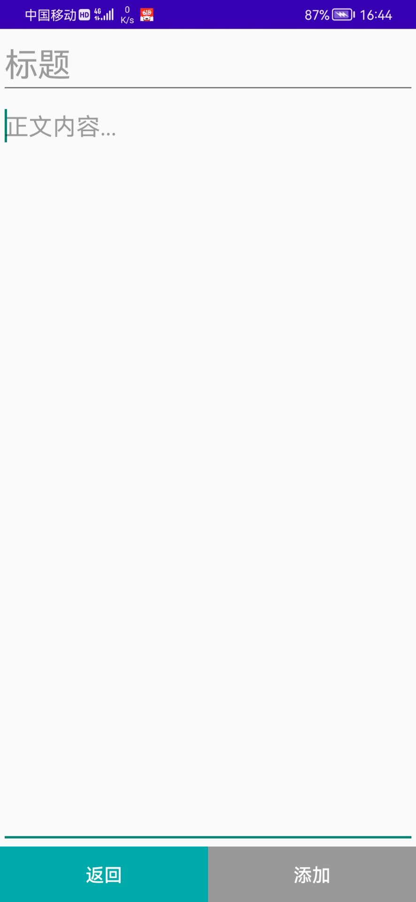
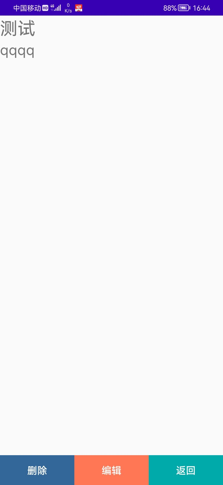
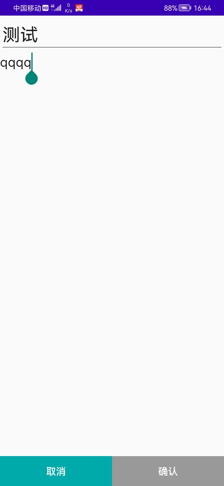
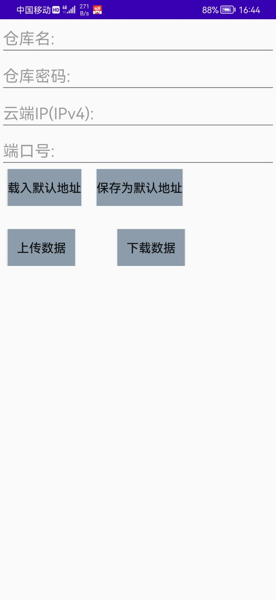

# MEMO

## 前言

在荒废的人生中水乐一个安卓的课设。

## 介绍

这是一个备忘录APP，备忘录功能部分借鉴了[xmenw/Note: 安卓记事本 (github.com)](https://github.com/xmenw/Note)模式。

## 主要功能

1. 用户在**主页面**能看到自己所有的记事本，点击某个记事本可以进入**单个记事本页面**， 点击`失落近亲`图标可以进入**增加记事本页面**，点击`大黄蜂`图标可以进入**云端同步页面**。
2. 在**增加记事本页面**书写内容，点击添加，可以添加新的记事本。
3. 在**单个记事本页面**可以选择`编辑`进入**编辑页面**，或`删除`把记事本删除。
4. 在**编辑页面**可以修改记事本内容。
5. 在**云端同步页面**可以把自己的记事本数据同步至云端的某个仓库，或把本地数据替换为云端某个仓库的数据，若不愿意每次填写云端地址，可以将地址先行储存，一键导入。

## 实现方式

1. 客户端和服务端的数据存储皆使用sqlite。
2. 使用socket通过TCP协议实现数据传输。
3. 后端代码是一个写的非常摆烂的python脚本，详见server分支。

## 功能特性

1. 本APP没有注册登录功能，每个仓库单独设置仓库名和密码，仓库共享，但需要密码认证。
2. 若仓库不存在，则根据传输的仓库名和密码新建仓库，密码为用户传递的密码。

## 效果图

主页面

添加页面

单个备忘录页面

编辑页面

云端同步页面

## 注意事项

**本项目仅供学习使用**

**不要储存重要信息，因为数据在传输过程中没有任何加密！(不想做加密乐，太懒乐)**